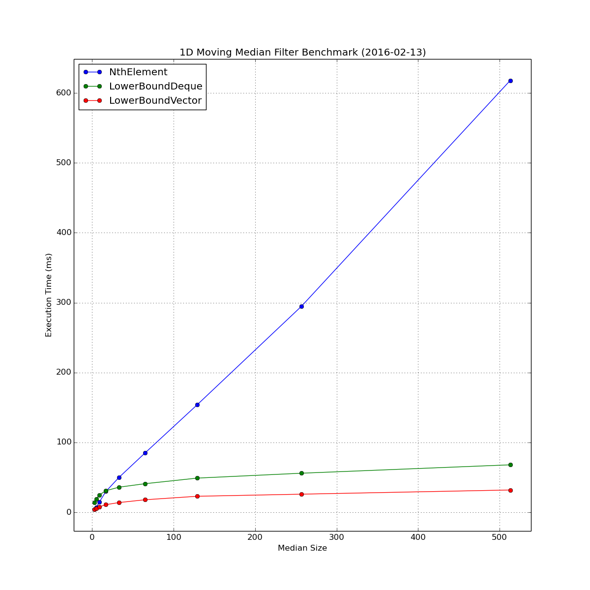
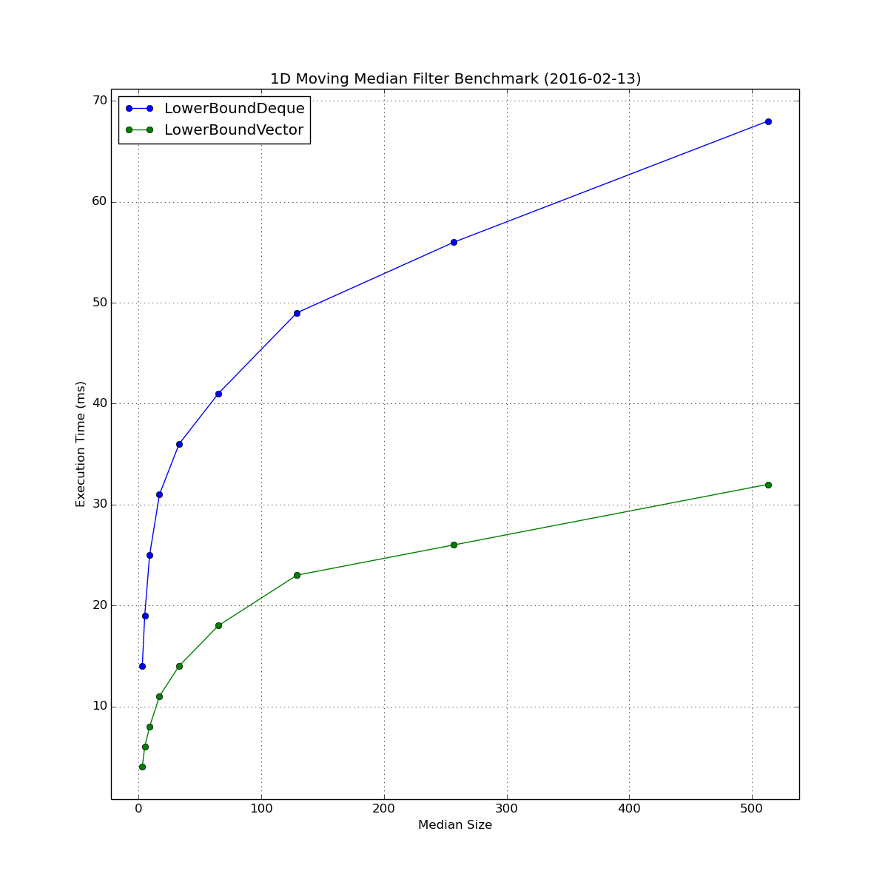

1D Moving Median Benchmark
==========================

What is this?
-------------

This is a stand-alone C++11 program that times various techniques for performing a 1D moving median filter (sometimes called rolling median, or streaming median).

It currently only uses a signle thread.

How to build
------------

.. code-block:: bash

    g++ -o main main.cpp -std=c++11 -O3

How to execute benchmark
------------------------

.. code-block:: bash

    ./main --help

    usage: main OPTIONS

    Options:

        -h|--help    Displays this help message
        --short      Runs the benchmark using short type
        --int        Runs the benchmark using int type
        --long-long  Runs the benchmark using long long type
        --float      Runs the benchmark using float type
        --double     Runs the benchmark using double type

.. code-block:: bash

    ./main --float

Current Results
---------------

.. code-block::

    All times are milliseconds
    T = float
    Filtering random std::vector<float>
        vector.size() = 128000
        n iterations  = 15
    TABLE:
          Window          NthElement      LowerBoundDeque  LowerBoundVector
             3                 4                14                 4
             5                 7                19                 6
             9                15                25                 8
            17                30                31                11
            33                50                36                14
            65                85                41                18
            129               154               49                23
            257               295               56                26
            513               618               68                32

All Stats Plotted
~~~~~~~~~~~~~~~~~

Ingoring Nth Element
~~~~~~~~~~~~~~~~~~~~

